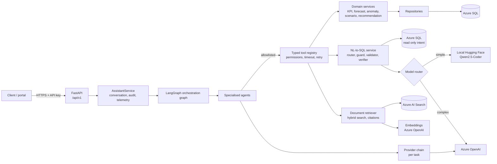
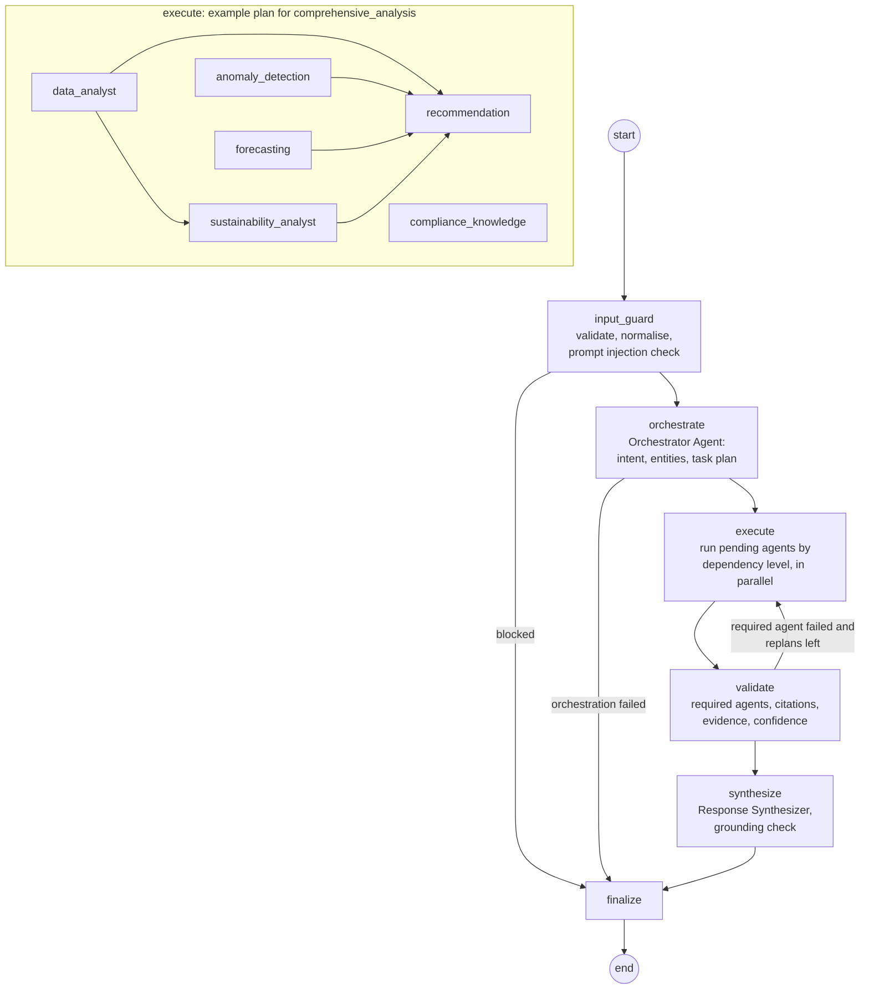
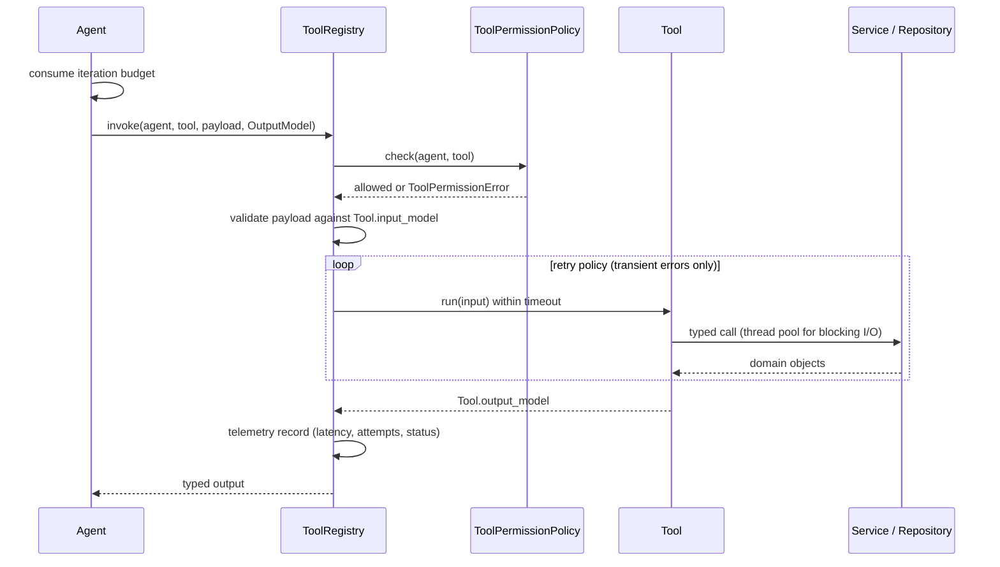
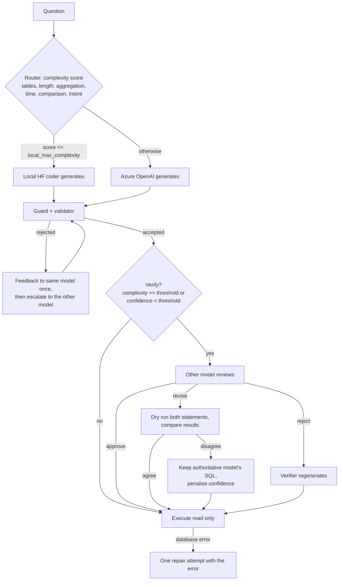
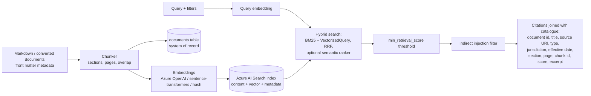

# Multi-Agent Sustainability Advisor

An enterprise assistant that answers sustainability questions, analyses emissions and energy data, investigates anomalies, forecasts emissions, runs what-if scenarios, recommends corrective actions and explains compliance obligations. Every figure it states comes from Azure SQL or cited enterprise documents.

## Contents

1. [Business problem](#business-problem)
2. [Architecture](#architecture)
3. [Agent graph](#agent-graph)
4. [Repository structure](#repository-structure)
5. [Agent responsibilities](#agent-responsibilities)
6. [Tool architecture](#tool-architecture)
7. [Data flow](#data-flow)
8. [Intelligent SQL routing with the local Hugging Face model](#intelligent-sql-routing-with-the-local-hugging-face-model)
9. [RAG architecture](#rag-architecture)
10. [Recommendation engine](#recommendation-engine)
11. [Security and guardrails](#security-and-guardrails)
12. [Configuration](#configuration)
13. [Setup](#setup)
14. [API](#api)
15. [Observability](#observability)
16. [Testing](#testing)
17. [Evaluation](#evaluation)
18. [Docker](#docker)
19. [CI/CD](#cicd)
20. [Production deployment](#production-deployment)
21. [Troubleshooting](#troubleshooting)

## Business problem

Sustainability, operations and finance teams need fast, defensible answers to questions such as:

* Is a site on track against its emissions intensity and renewable energy targets?
* Why did emissions spike in April, and what should the site do about it?
* Will we meet the emissions target over the next six months?
* What happens to emissions if a site cuts energy use by 10 percent and buys 60 percent renewable electricity?
* What does ESRS E1 require us to disclose, and what does our environmental permit require after a fuel use deviation?

The data needed to answer these questions is spread across the sustainability data mart (Azure SQL) and policy, regulatory, permit and audit documents. Analysts spend days assembling it by hand, and generic chatbots cannot be trusted with it: they invent numbers and savings, and they cite nothing.

This assistant splits the work between specialised agents. Each agent can only use its own typed tools. Numbers come only from tool evidence. Every document claim carries a citation. A response that cannot be grounded is flagged as low confidence rather than presented as fact.

## Architecture



Layering is strict:

| Layer | Knows about | Never touches |
| --- | --- | --- |
| API | AssistantService, request/response schemas | agents, database |
| Graph | agents, guardrails | tools, repositories |
| Agents | tool registry, provider chain, prompts | engines, SDK clients, SQL |
| Tools | services, retriever, NL-to-SQL service | HTTP |
| Services / NL-to-SQL / retriever | repositories, engines, index adapters | agents |
| Repositories | SQLAlchemy Core tables | business rules |

Azure SQL is reached only through repositories (parameterised SQLAlchemy Core) and the read only SQL executor (guarded, validated model SQL).

## Agent graph



The state (`graph/state.py`) is an explicit typed mapping: request, guard outcome, intent, entities, plan, pending agents, results, iteration, replans, validation, synthesis and final payload. Nodes communicate only through it.

Loops are bounded three ways: `orchestration.max_replans`, `orchestration.max_graph_iterations` and LangGraph's `recursion_limit`. Each agent also has its own iteration budget.

## Repository structure

```
.
├── configs/                  base.yaml + development/test/production overlays
├── prompts/<name>/v1.yaml    versioned prompt templates (no prompts in code)
├── data/
│   ├── documents/            sample enterprise documents (Markdown + front matter)
│   └── seed/dev_seed.yaml    synthetic operating history for dev and tests
├── evaluation/golden_set.yaml golden set and quality thresholds
├── migrations/               Azure SQL DDL (001) and least privilege roles (002)
├── scripts/check_style.py    house style gate (no em or en dashes)
├── src/sustainability_advisor/
│   ├── main.py               FastAPI app factory
│   ├── container.py          composition root (dependency wiring)
│   ├── config/               typed settings, layered YAML + SA_ env loader
│   ├── domain/               entities, evidence, citations, recommendations, errors
│   ├── db/                   table definitions, Azure SQL / SQLite engines
│   ├── repositories/         one repository per entity
│   ├── services/             KPI, forecast, anomaly, scenario, recommendation,
│   │                         audit/conversation, assistant (application) service
│   ├── sql/                  catalogue, router, generator, guard, validator,
│   │                         executor, NL-to-SQL service
│   ├── llm/                  provider contract, Azure OpenAI, local Hugging Face,
│   │                         mock, structured output, provider chain
│   ├── retrieval/            embeddings, chunking, filters, Azure AI Search and
│   │                         in process indexes, retriever, ingestion
│   ├── tools/                typed tools and the permissioned registry
│   ├── agents/               the ten agents
│   ├── graph/                state and LangGraph builder
│   ├── guardrails/           input, injection, permissions, output, grounding,
│   │                         confidence and citation policy
│   ├── observability/        context ids, structured logging, telemetry
│   ├── evaluation/           golden set harness (sa-evaluate)
│   ├── devdata/              seeder (sa-seed)
│   └── api/                  routes, schemas, middleware, auth, error mapping
├── tests/                    unit, security, retrieval, graph, api, evaluation
├── Dockerfile, docker-compose.yml, .github/workflows/{ci,cd}.yml
└── pyproject.toml            dependencies, ruff, mypy (strict), pytest
```

## Agent responsibilities

Every agent is declared in `configs/base.yaml` under `agents` with its responsibility, allowed tools, timeout, retry policy, maximum iterations, prompt, minimum confidence and whether the graph treats it as required. In code each agent declares its output data schema. `BaseAgent.execute` enforces all of this and turns every failure into an `AgentResult` with status `failed`, so exceptions never escape into the graph.

| Agent | Responsibility | Tools | Output |
| --- | --- | --- | --- |
| Orchestrator | Classify intent (forced, model, or keyword fallback), resolve facilities, period, KPIs, metrics, horizon, levers and jurisdiction, and build a dependency levelled plan from configuration | `facility_directory` | `OrchestratorOutput` |
| Sustainability Analyst | Judge performance: KPI trend against the prior equal-length period, direction-aware, with off-target list | `sustainability_kpi_lookup` | `SustainabilityAnalystOutput` |
| Data Analyst | Compute configured KPIs with targets and rank facilities | `sustainability_kpi_lookup`, `azure_sql_query` | `DataAnalystOutput` |
| Emission Forecasting | Backtested forecasts against prorated targets, and what-if scenarios on measured baselines | `emission_forecast`, `scenario_analysis` | `ForecastAgentOutput` |
| Anomaly Detection | Robust z score and isolation forest detection on emissions, energy, production or sensor series | `anomaly_analysis` | `AnomalyAgentOutput` |
| Recommendation | Turn upstream evidence into ranked, evidence-linked actions | `recommendation_ranking` | `RecommendationAgentOutput` |
| Document Intelligence | Hybrid retrieval over enterprise documents with vector fallback; every passage is a citation | `document_search`, `vector_search` | `DocumentAgentOutput` |
| SQL Agent | Natural language data querying through the routed, verified, read only SQL pipeline | `azure_sql_query` | `SQLAgentOutput` |
| Compliance Knowledge | Retrieval restricted to regulatory document types, then model extraction of obligations that must cite retrieved passages | `document_search`, `vector_search` | `ComplianceOutput` |
| Response Synthesizer | Grounded answer, key findings and a short decision explanation; deterministic evidence composition when the model is unavailable, ungrounded or fails | none | `SynthesisOutput` |

Which agents answer which intent is configuration (`orchestration.intents`), as are the dependencies between agents (`orchestration.agent_dependencies`).

## Tool architecture



| Tool | Input | Output | Backed by |
| --- | --- | --- | --- |
| `azure_sql_query` | question, intent, context, max_rows | `SQLAnswer` (SQL, rows, generator, verifier, confidence) | NL-to-SQL service |
| `sustainability_kpi_lookup` | facility ids, KPIs, period | `KpiValue` list with targets and status | KPI service |
| `document_search` | query, metadata filters, top_k | `RetrievalResult` with citations | hybrid retriever |
| `vector_search` | query, metadata filters, top_k | `RetrievalResult` with citations | vector retriever |
| `anomaly_analysis` | facility, metric, period | findings, points analysed | anomaly service |
| `emission_forecast` | facility, horizon, scopes | `ForecastOutcome` | forecast service |
| `scenario_analysis` | facility, levers, baseline period | `ScenarioOutcome` | scenario service |
| `recommendation_ranking` | evidence list | ranked `Recommendation` list | recommendation service |
| `facility_directory` | include inactive | facilities with latest data period | repositories |

Only transient failures are retried (dependency unavailable, retrieval errors, timeouts). Invalid input, missing data and SQL safety rejections fail immediately.

## Data flow

1. **Request**: middleware assigns or accepts `X-Request-ID`, enforces the body size limit and binds correlation ids. The API key is checked in constant time.
2. **Input guard**: the message is NFKC normalised, stripped of control and zero-width characters, and length checked. It is then scored against the configured injection patterns.
3. **Orchestration**: the facility directory is loaded and intent is classified. Entities are resolved in precedence order: API hints, then validated model extraction, then text rules, then configured defaults anchored on the latest month with data. The plan is built.
4. **Execution**: agents run level by level. Agents in one level run concurrently up to `max_parallel_agents`, and each receives the results of its dependencies.
5. **Evidence**: every tool result becomes typed `Evidence`: KPI, SQL result, forecast, anomaly, scenario or document. Each carries values, attributes, citations and a confidence score.
6. **Validation**: checks required agents, the citation requirement, that evidence exists, and the aggregate confidence. A failed required agent triggers one bounded replan of that agent and its dependants.
7. **Synthesis**: the model receives numbered evidence `[E1]`, citations `[C1]` and recommendations. The draft passes the grounding check or is retried once with the specific problems. After that the deterministic composer takes over.
8. **Finalize**: hidden reasoning tags and dashes are removed and length is bounded. The final confidence and low confidence flag are computed.
9. **Persistence**: user and assistant messages, recommendations and audit events are written through repositories. A `response.final` log event records intent, confidence, citations, tokens and latency.

## Intelligent SQL routing with the local Hugging Face model

The SQL agent's tool runs `NLToSQLService`, which combines a local Hugging Face coder model (`Qwen/Qwen2.5-Coder-0.5B-Instruct` by default, set in `llm.local.model_id`) with Azure OpenAI:



* The model that did not generate becomes the verifier, so the cross check is independent.
* Every candidate, including verifier corrections and repairs, passes the guard and the validator before it runs.
* Routing weights, thresholds, keywords, the disagreement penalty and repair attempts are all in `routing` in the configuration.
* When Azure OpenAI is not configured, the local model generates alone and the response reports `verification: not_required`.
* The local coder model is deliberately not used for intent classification, compliance extraction or answer writing (`llm.task_provider_order`). A 0.5B coder is reliable for SQL but not for those tasks, and the keyword classifier and deterministic composer are safer fallbacks.

## RAG architecture



* **Hybrid retrieval**: in production Azure AI Search receives the text and a `VectorizedQuery` in one request and fuses them itself, optionally reranking semantically. In development and tests, `InMemoryHybridIndex` implements the same contract with BM25, cosine similarity and reciprocal rank fusion.
* **Metadata filters**: `doc_type` (a list), `jurisdiction`, `facility_id` (facility specific or group wide) and `effective_date`. Allowed fields come from configuration, and values are escaped when translated to OData.
* **Citations**: each citation carries document id, title, source URI, document type, jurisdiction, effective date, section, page, chunk id, normalised retrieval score and excerpt. Answers reference them as `[C1]`, and the response returns each citation with its marker.
* **Citation requirement**: document-derived evidence without a citation fails validation, and model obligations that cite unknown passages are dropped.
* **Ingestion**: `sa-ingest` is idempotent by checksum and keeps the `documents` table and the index in step.

## Recommendation engine

Recommendations come only from evidence produced in the same request:

| Evidence | Issue type | Severity |
| --- | --- | --- |
| KPI with status `off_track` | `kpi_off_target` | from gap ratio thresholds |
| Detected anomaly | `anomaly` | the anomaly's severity band |
| Forecast above prorated target | `forecast_exceeds_target` | from gap ratio thresholds |

Wording, actions and complexity come from playbooks in configuration (`recommendations.playbooks`, keyed `<issue_type>.<subject>` with `<issue_type>` as fallback). Each recommendation carries `recommendation_id`, `issue`, `severity`, `business_impact`, `estimated_complexity`, `estimated_cost`, `expected_sustainability_impact`, `priority`, `evidence` (evidence ids present in the response), `confidence` and `actions`.

**No invented money.** `estimated_cost.value` is set only when the playbook names a reference metric and the facility has an approved value for it in `sustainability_metrics`. Otherwise it is `null` with the basis "No approved cost estimate exists" and uncertainty "Unknown". `expected_sustainability_impact` is the addressable gap measured in the evidence, labelled as an upper bound, or `null` when it cannot be quantified. Priority is a configured weighted score of severity, confidence, ease and evidence coverage, mapped to bands.

## Security and guardrails

| Control | Implementation |
| --- | --- |
| Authentication | `X-API-Key` checked with constant-time comparison; comma separated keys for rotation (`SA_API_KEYS`); health probes are public |
| Input validation | NFKC normalisation, control and zero-width removal, length bounds, identifier regex for facility and conversation ids, request size limit |
| Prompt injection | Weighted, configurable patterns on normalised text; applied to user messages (blocked before any agent runs) and to retrieved passages (dropped) |
| Tool permissions | Per-agent allowlist enforced by the registry on every call |
| SQL safety | sqlglot AST guard: single statement, SELECT only, no nested writes, no `SELECT INTO`, blocked functions and prefixes, no variables, temp tables, cross database or system schemas, plus a raw token scan. The validator adds a catalogue allowlist of tables and columns, a join limit, a subquery depth limit, no `SELECT *` and a row cap. The executor runs on a read only engine (`ApplicationIntent=ReadOnly`, optional separate least privilege identity, query timeout) |
| Output validation | Response schemas, removal of hidden reasoning tags (`<think>` and similar), no em or en dashes, bounded length |
| Hallucination control | Every number in the answer must match tool evidence (with tolerance for rounding and percentages); citation markers must exist; one feedback retry, then deterministic composition |
| Citation requirement | Document findings need citations; obligations must cite retrieved passages |
| Confidence thresholds | Agent `min_confidence` lowers status to `partial`. Final confidence is evidence weighted, penalised when validation fails, and flagged when below `guardrails.min_final_confidence` |
| Iteration limits | Per-agent iteration budget, bounded replans and graph iterations, LangGraph recursion limit |
| Hidden reasoning | Never returned: responses contain the answer, findings and a short evidence-based decision explanation |
| Secrets | Configuration holds variable names only. Entra ID for Azure SQL, Azure OpenAI and Azure AI Search by default; Key Vault backed environment variables in production |
| Least privilege | `migrations/002_roles.sql`: the app role writes only audit, conversation and results tables; the query role reads only the exposed tables |
| Audit | Append-only `audit_events` per request (received, completed or blocked, timeout) |

## Configuration

Resolution order, later wins:

1. `configs/base.yaml`
2. `configs/<SA_ENV>.yaml` (`development`, `test`, `production`)
3. environment variables `SA_<SECTION>__<KEY>[__<KEY>]`, JSON-parsed when valid JSON

Every section is validated by a pydantic model that forbids unknown keys, and cross references are checked: intents to agents, agents to tools, and API intents to configured intents. Fields ending in `_env` name an environment variable and never hold a secret.

| Section | Externalises |
| --- | --- |
| `app`, `api`, `logging` | service identity, prefix, CORS, request limits, auth header and key variable, log level and format |
| `database` | backend, schema, timeouts, Azure SQL driver, auth mode, identities, pooling, SQLite path |
| `llm` | provider order per task, JSON repair attempts, Azure OpenAI deployment, API version and limits, local model id, revision, device, dtype, tokens, timeout, concurrency |
| `routing` | SQL router thresholds, weights, keywords, verification and repair policy |
| `sql` | allowed statements, blocklists, limits, exposed tables and columns with descriptions and synonyms |
| `retrieval` | backend, top_k, fusion weights, minimum score, BM25 parameters, filter allowlist, Azure AI Search index and fields, embeddings, chunking |
| `guardrails` | input limits, injection patterns and threshold, confidence threshold and penalty, grounding tolerance, reasoning tags |
| `orchestration` | intents with keywords and agents, agent dependencies, iteration, replan and recursion limits, parallelism, default lookback |
| `agents`, `tools` | every agent and tool contract (see above) |
| `kpis`, `forecasting`, `anomaly`, `scenario`, `recommendations` | KPI formulas and targets, forecasting methods and horizons, detector thresholds and bands, scenario levers, severity, priority and playbooks |
| `prompts`, `compliance`, `conversation` | prompt folder and version, regulatory document types, history length |

Examples:

```bash
SA_ENV=production
SA_ROUTING__LOCAL_MAX_COMPLEXITY=0.3
SA_LLM__LOCAL__MODEL_ID=Qwen/Qwen2.5-Coder-1.5B-Instruct
SA_GUARDRAILS__MIN_FINAL_CONFIDENCE=0.65
```

`.env.example` lists every secret-bearing variable.

## Setup

Requirements: Python 3.11 or later. For Azure SQL, Microsoft ODBC Driver 18 for SQL Server.

```bash
python -m venv .venv
. .venv/bin/activate                      # Windows: .venv\Scripts\activate
pip install -e ".[dev]"
pip install -e ".[local]" --extra-index-url https://download.pytorch.org/whl/cpu   # local HF models
pip install -e ".[azure]"                 # pyodbc for Azure SQL
cp .env.example .env                      # SA_ENV=development

sa-seed --spec data/seed/dev_seed.yaml    # synthetic history into var/sustainability.db
uvicorn sustainability_advisor.main:create_app --factory --reload --port 8000
```

In development the documents in `data/documents` are indexed at start up with `sentence-transformers/all-MiniLM-L6-v2`. The first run downloads that model and the Qwen coder model. Set `AZURE_OPENAI_ENDPOINT` (and a key or `az login`) to enable Azure OpenAI; without it the local model handles SQL and deterministic components handle the rest.

## API

All assistant routes require `X-API-Key` (disabled in `development`). Every response carries `X-Request-ID`.

| Method | Path | Purpose |
| --- | --- | --- |
| POST | `/api/v1/assistant/chat` | Free-form question; optional `conversation_id`, `facility_ids`, `period_start`/`period_end` |
| POST | `/api/v1/assistant/analyze` | Full analysis of facilities over a period (forced intent `api.analyze_intent`) |
| POST | `/api/v1/assistant/scenario` | What-if analysis with configured levers (forced intent `api.scenario_intent`) |
| GET | `/api/v1/assistant/conversations/{id}` | Conversation messages and recommendations |
| GET | `/api/v1/health` | Liveness, no dependency calls |
| GET | `/api/v1/ready` | Database, search index and model provider readiness (503 when not ready) |

```bash
curl -s localhost:8000/api/v1/assistant/chat -H "Content-Type: application/json" \
  -d '{"message": "Is FAC-001 on track against its renewable share target?"}'

curl -s localhost:8000/api/v1/assistant/analyze -H "Content-Type: application/json" \
  -d '{"facility_ids": ["FAC-001"], "period_start": "2024-07-01", "period_end": "2025-06-30"}'

curl -s localhost:8000/api/v1/assistant/scenario -H "Content-Type: application/json" \
  -d '{"facility_id": "FAC-001", "levers": {"energy_efficiency_pct": 10, "renewable_electricity_pct": 60}}'
```

Response (abridged):

```json
{
  "request_id": "req_...", "conversation_id": "conv_...", "intent": "kpi_analysis",
  "answer": "...", "key_findings": ["..."], "decision_explanation": "...",
  "confidence": 0.87, "low_confidence": false, "grounded": true, "blocked": false,
  "recommendations": [{"recommendation_id": "rec_...", "issue": "...", "severity": "critical",
    "estimated_cost": {"value": null, "basis": "No approved cost estimate exists ...", "uncertainty": "Unknown. ..."},
    "expected_sustainability_impact": {"value": 28.73, "unit": "%", "basis": "...", "uncertainty": "..."},
    "priority": "P1", "evidence": ["ev_kpi_..."], "confidence": 1.0, "actions": ["..."]}],
  "citations": [{"marker": "C1", "document_id": "DOC-PERMIT-FAC001", "title": "...", "section": "...", "page": 3, "retrieval_score": 0.98, "excerpt": "..."}],
  "evidence": [{"evidence_id": "ev_kpi_...", "kind": "kpi", "summary": "...", "confidence": 1.0}],
  "agents": [{"agent": "orchestrator", "status": "success", "latency_ms": 12.1, "iterations": 2, "errors": []}],
  "sql": null, "warnings": [], "token_usage": {"prompt_tokens": 0, "completion_tokens": 0}, "latency_ms": 181.4
}
```

Errors use one shape: `{"code", "message", "request_id", "details"}`, for example `input_rejected` (422), `unauthenticated` (401), `not_found` (404), `request_too_large` (413) and `internal_error` (500, with no internal detail). A prompt injection returns 200 with `blocked: true` and no agent execution.

## Observability

Structured logs (JSON in deployed environments) carry `request_id` and `conversation_id` on every event:

| Event | Fields |
| --- | --- |
| `http.request` | method, path, status, latency |
| `agent.completed` | agent, status, latency, attempts, iterations, confidence, evidence and citation counts, error |
| `tool.completed` | tool, calling agent, status, latency, attempts, error |
| `llm.call` | provider, model, task, latency, prompt and completion tokens, status |
| `sql.routing` | primary, verifier, complexity, reason |
| `retrieval.result` | mode, result count, top score, all scores |
| `graph.replan` / `graph.synthesis_fallback` | agents, reasons |
| `response.final` | intent, final confidence, low confidence, blocked, citations, recommendations, tokens, latency |

Per-request telemetry (`observability/telemetry.py`) aggregates the same data. Audit events are persisted in `audit_events`. On Azure Container Apps, ship stdout to Log Analytics and query by `request_id`.

## Testing

```bash
python scripts/check_style.py     # no em or en dashes anywhere
ruff check . && ruff format --check .
mypy                              # strict
pytest -m "not local_model and not live_azure"
pytest -m local_model             # real Qwen coder SQL generation (cached model only)
```

| Suite | Covers |
| --- | --- |
| `tests/unit/test_agents.py` | orchestrator classification (model, keyword fallback, forced), entity resolution, plans, iteration budget, timeouts, disabled agents, scenarios, compliance citation filtering, synthesizer grounding and fallback |
| `tests/graph` | end-to-end flows, injection block, orchestrator failure, bounded replanning, dependency levels, synthesis fallback, conversation history, per-task provider routing |
| `tests/unit/test_tools.py` | permissions, input validation, timeout, retry, telemetry, typed outputs |
| `tests/unit/test_sql_routing.py` | routing, verification, dry-run settlement, escalation, repair, row cap |
| `tests/security` | SQL attack corpus, validator allowlists, injection corpus, input and output guards, grounding, permissions, confidence and citation policy |
| `tests/retrieval` | chunking, OData escaping, filters, RRF, hybrid and vector search, citations, indirect injection, idempotent ingestion |
| `tests/unit/test_services.py` | KPI maths, target scaling, null handling, forecasting, anomaly detection, scenarios, recommendation evidence and cost rules |
| `tests/api` | every endpoint, auth, validation and error formats, request ids, size limits |
| `tests/evaluation` | golden set thresholds |

`MockLLM` (`llm/mock.py`) is a scripted provider keyed by task that records every call. The fixtures register one mock as `local` and one as `azure_openai`, so routing, verification and fallback run exactly as in production. Current result: 158 tests pass with 92 percent line coverage, and the `local_model` test passes against the cached Qwen2.5-Coder-0.5B model.

## Evaluation

`evaluation/golden_set.yaml` defines intent cases, retrieval cases (query to relevant document) and end-to-end cases, with thresholds. `sa-evaluate` (or `pytest -m evaluation`) reports:

* intent accuracy
* retrieval hit rate at k and mean reciprocal rank
* end-to-end intent and agent accuracy
* grounded answer rate (every figure traced to evidence)
* citation coverage for document questions
* recommendation evidence integrity

A metric below its threshold fails the build. Run it against development or a staging deployment:

```bash
SA_ENV=development sa-evaluate --golden evaluation/golden_set.yaml
```

## Docker

```bash
docker build -t sustainability-advisor .                        # bakes the local model
docker build --build-arg BAKE_LOCAL_MODEL=false -t sa:slim .    # without the model
docker compose up --build                                       # development stack on :8000
```

The image is multi-stage on `python:3.12-slim`. It includes ODBC Driver 18, CPU-only torch and the Qwen coder weights (baked in, `HF_HUB_OFFLINE=1`). It runs as a non-root user and has a health check.

## CI/CD

* **`ci.yml`** (pull requests and main):
  * house style check, ruff, format check, mypy strict
  * tests on Python 3.11, 3.12 and 3.13 with coverage
  * golden set evaluation
  * a real local model SQL test with a cached Hugging Face download
  * image build
* **`cd.yml`** (tags):
  * Azure login through OIDC (no stored secrets)
  * build and push to ACR
  * apply `migrations/*.sql` with Entra ID `sqlcmd`
  * index documents into Azure AI Search
  * deploy a new Azure Container Apps revision
  * readiness smoke test, with automatic traffic rollback to the previous revision if it fails

## Production deployment

1. **Azure SQL**: create the database and apply `migrations/001_schema.sql`. Create two managed identities, then apply `002_roles.sql` with `APP_IDENTITY` and `QUERY_IDENTITY`. Set `AZURE_SQL_QUERY_IDENTITY_CLIENT_ID` so model SQL runs as the read only identity. Enable a readable secondary if you want read-intent routing.
2. **Azure AI Search**: provision index `sustainability-documents` with fields `chunk_id` (key), `document_id`, `title`, `source_uri`, `doc_type`, `jurisdiction`, `facility_id` (filterable), `effective_date` (DateTimeOffset, filterable), `section`, `page`, `ordinal`, `content` (searchable) and `content_vector` (1536 dimensions, HNSW). Add a semantic configuration named `sustainability-semantic`.
3. **Azure OpenAI**: deploy the chat model named in `llm.azure_openai.chat_deployment` and the embedding model named in `retrieval.embeddings.model`. Grant the app identity *Cognitive Services OpenAI User*, and *Search Index Data Reader/Contributor* on the search service.
4. **Container Apps**: run the image with `SA_ENV=production`, the Azure endpoint variables and `SA_API_KEYS` from Key Vault references. Probe `/api/v1/health` for liveness and `/api/v1/ready` for readiness. Allocate at least 2 vCPU and 4 GiB per replica for the local model. Scale on HTTP concurrency.
5. **Ingress**: put Azure API Management or Front Door in front for TLS, WAF and rate limits. Optionally switch `api.auth.enabled` off when the gateway enforces Entra ID.
6. **Operations**: send logs to Log Analytics, alert on `status=error` agent or tool events, `low_confidence` rates and readiness failures, and run `sa-evaluate` against staging before each release.

## Troubleshooting

| Symptom | Cause and fix |
| --- | --- |
| `ConfigurationError: SA_ENV must be set` | Set `SA_ENV` or create `.env` from `.env.example` |
| `Invalid configuration ... extra inputs are not permitted` | A misspelt key in YAML or an `SA_...__...` variable; keys are validated strictly |
| `/ready` returns 503 with `database: error` | Azure SQL: check `AZURE_SQL_SERVER`/`DATABASE`, ODBC Driver 18, firewall and the managed identity's database user |
| `llm.local: unavailable` | Install the `local` extra; the model id must be downloadable, or cached when `HF_HUB_OFFLINE=1` |
| Local SQL generation is slow | CPU generation takes seconds per query. Set `llm.local.num_threads`, keep `max_concurrency: 1`, lower `routing.local_max_complexity` to route more to Azure, or use a GPU `device` |
| Answers say "Here is what the evidence shows" instead of prose | No chat model is available for synthesis (Azure OpenAI not configured or failing); the deterministic composer is answering. Configure Azure OpenAI |
| `sql_rejected` errors | The guard or validator refused the model's SQL. Check the `sql.routing` and `sql.generation_rejected` logs; expose the needed table or column in `sql.exposed_tables` if appropriate |
| Document questions return no citations | Check `min_retrieval_score` and the index document count in `/ready`, and run `sa-ingest --force` |
| Responses flagged `low_confidence` | A required agent failed or evidence was thin; see `warnings` and the per-agent `errors` in the response |
| `blocked: true` for a legitimate question | An injection pattern matched; tune `guardrails.injection_patterns` or the threshold, and add the case to the tests |
